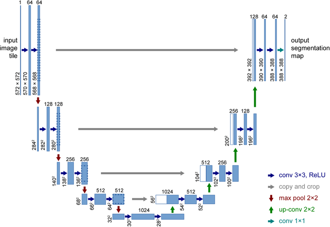
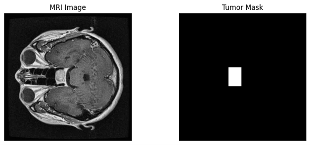

# U-Net From Paper

> A research-oriented implementation and analysis of the original U-Net architecture for biomedical image segmentation.

---

# U-Net Architecture

<p align="center">
  
</p>


---

# Dataset Example

The project uses the **Brain Tumor Semantic Segmentation Dataset**.

Each sample consists of:

- an MRI image
- a corresponding binary segmentation mask

<p align="center">
  
</p>

Mask values

| Pixel Value | Meaning |
|------------:|---------|
| 0 | Background |
| 255 | Tumor |

---


---

# Project Goal

This repository is **not only an implementation of U-Net**.

The objective is to understand every component of the original paper, reproduce the original implementation, perform systematic experiments, and document every result.

The repository will include:

- Paper explanation
- Code explanation
- Dataset preparation
- Model training
- Evaluation
- Hyperparameter tuning
- Architecture comparison
- Experimental analysis

---

# Dataset

Dataset:

**Brain Tumor Image Dataset – Semantic Segmentation**

Task:

Binary Semantic Segmentation

Dataset statistics

| Split | Images |
|-------:|-------:|
| Train | 1503 |
| Validation | 430 |
| Test | 216 |

Image size

```
640 × 640
```

---

# Planned Experiments

## Hyperparameters

- Learning Rate
- Batch Size
- Number of Epochs
- Weight Decay
- Momentum

## Optimizers

- Adam
- AdamW
- SGD
- RMSprop

## Loss Functions

- Cross Entropy
- Dice Loss
- BCE + Dice
- Focal Loss
- Tversky Loss

## Evaluation Metrics

- Dice Score
- Dice Loss
- IoU
- Precision
- Recall
- F1-score
- Accuracy
- Confusion Matrix

## Architecture Improvements

- Attention U-Net
- UNet++
- ResUNet
- UNETR
- SwinUNETR

---

# Repository Structure

```
paper/
implementation/
dataset/
experiments/
results/
figures/
```

---

---

# Acknowledgment

This project is based on the excellent open-source implementation:

https://github.com/milesial/Pytorch-UNet


Paper :Ronneberger, O., Fischer, P., Brox, T. (2015). U-Net: Convolutional Networks for Biomedical Image Segmentation. In: Navab, N., Hornegger, J., Wells, W., Frangi, A. (eds) Medical Image Computing and Computer-Assisted Intervention – MICCAI 2015. MICCAI 2015. Lecture Notes in Computer Science(), vol 9351. Springer, Cham. https://doi.org/10.1007/978-3-319-24574-4_28

The purpose of this repository is educational and research-oriented. During this project, the original implementation will be carefully studied, progressively modified, and eventually replaced with my own implementation while documenting every experiment and design decision.
