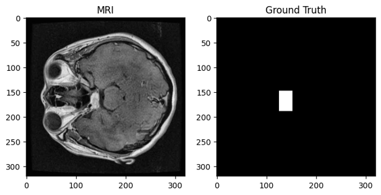
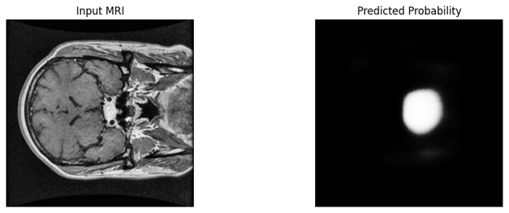
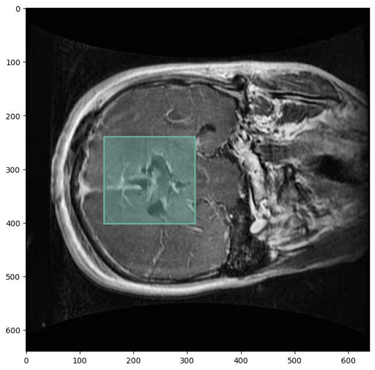
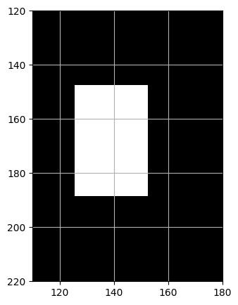

# Brain Tumor Semantic Segmentation using U-Net

## Project Overview

This project implements the U-Net architecture for brain tumor semantic segmentation using PyTorch. The objective is to identify tumor regions in brain MRI images through pixel-wise classification.

The implementation includes:

- Dataset preprocessing
- COCO-to-mask conversion
- U-Net training
- Model evaluation
- Visualization of predictions
- Dataset quality analysis

---

# Dataset

The dataset was obtained from Kaggle and contains **2146 MRI images** with tumor annotations provided in COCO segmentation format.

The original COCO annotations were converted into binary segmentation masks compatible with the U-Net implementation.

The dataset was divided into:

- Training
- Validation
- Test

Each image was resized to **640×640** before export.

---

## Example Image and Ground Truth

Figure 1 shows one MRI slice together with its generated binary ground-truth mask.

<p align="center">

</p>

**Figure 1.** MRI image and corresponding binary ground-truth mask generated from the COCO annotations.

---

# Training

Model:

- U-Net
- PyTorch implementation
- Binary segmentation

Training parameters

| Parameter | Value |
|-----------|------:|
| Epochs | 10 |
| Batch Size | 4 |
| Learning Rate | 1e-4 |
| Image Scale | 0.5 |
| Loss | BCE + Dice Loss |

---

# Validation Results

The trained model was evaluated on the validation dataset.

| Metric | Value |
|---------|------:|
| Dice Score | **0.4897** |
| IoU | **0.3401** |
| Precision | **0.5924** |
| Recall | **0.4716** |
| F1 Score | **0.4986** |
| Accuracy | **0.9678** |

Confusion statistics

| Metric | Value |
|---------|-------:|
| TP | 6585 |
| TN | 387206 |
| FP | 4640 |
| FN | 8324 |

---

# Prediction Example

Figure 2 illustrates one prediction generated by the trained U-Net.

<p align="center">

</p>

**Figure 2.** Example probability map predicted by the trained U-Net.

The network successfully identifies the approximate tumor location. However, the predicted region is smooth and lacks the detailed tumor boundary expected in accurate semantic segmentation.

---

# Dataset Investigation

During evaluation, the predicted masks appeared considerably smoother and more regular than expected.

To understand this behavior, the original annotations were investigated.

---

## Original Annotation

Figure 3 shows the annotation generated from the original COCO file.

<p align="center">

</p>

**Figure 3.** Original COCO annotation overlaid on the MRI image.

---

## Generated Ground Truth Mask

Zooming into the generated mask reveals that the annotation corresponds to a simple rectangular region rather than the actual tumor contour.

<p align="center">

</p>

**Figure 4.** Zoomed view of the generated binary mask.

---

# Discussion

The qualitative inspection of the annotations indicates that the dataset does **not** provide precise tumor segmentations.

Instead, many masks correspond to coarse rectangular regions covering the approximate tumor location.

Consequently:

- the model learns to segment rectangles rather than tumor boundaries;
- Dice and IoU scores remain relatively low;
- prediction maps become smooth blob-like regions instead of anatomically meaningful tumor contours.

Therefore, the current dataset is **not suitable for high-quality medical image semantic segmentation** despite containing COCO annotations.

The observed limitations originate primarily from annotation quality rather than from the U-Net architecture itself.

---

# Conclusion

This project successfully demonstrates the complete semantic segmentation pipeline:

- preprocessing MRI data,
- converting COCO annotations,
- training a U-Net,
- evaluating segmentation performance,
- generating prediction visualizations.

However, detailed inspection revealed that the provided annotations are coarse bounding-region masks instead of accurate tumor contours.

Future work should employ expert-annotated medical datasets such as **BraTS**, where voxel-wise tumor segmentations are manually validated by neuroradiologists. Such datasets would allow the U-Net architecture to learn anatomically accurate tumor boundaries and substantially improve segmentation performance.

---

# Repository Structure

```
Pytorch-UNet/
│
├── train.py
├── evaluate.py
├── evaluate_and_plot.py
├── predict.py
├── unet/
├── utils/
├── checkpoints/
├── results/
└── figures/
    ├── 1.png
    ├── 2.png
    ├── 3.png
    └── 4.png
```

---

# Requirements

- Python 3.10+
- PyTorch
- torchvision
- matplotlib
- numpy
- tqdm
- pycocotools

Install using

```bash
pip install -r requirements.txt
```

---

# Author

**Morteza Alipour**

Biomedical Physics

University of Hamburg
